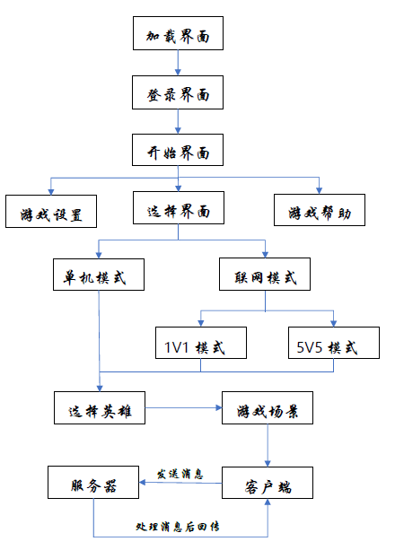
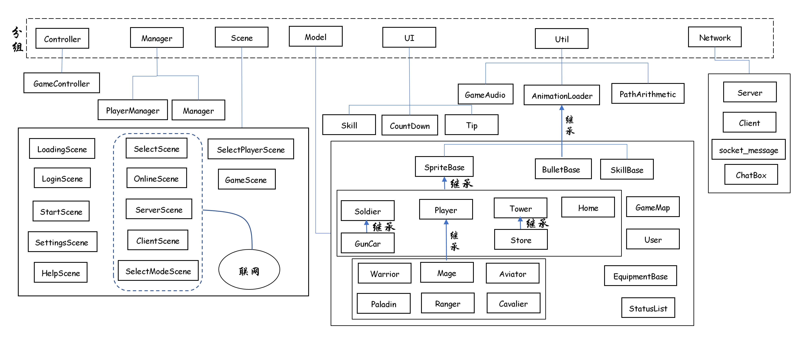

# *TheKingOfGlory项目文档*
***
* **项目名**：TheKingOgGlory(2D)
* **项目成员**：
    * 周楷彬 
    * 王宇其 
    * 庄泽杨 
* **项目github地址**:
    * https://github.com/cocosproject-thekingofglory/TheKingOfGlory
* **项目进度时间线**：
    * **2019.04.18**：创建新项目，上传到github
    * **2019.05.04**：制定项目开发计划及设计初步框架
    * **2019.05.08**：完成游戏加载、登录、开始界面
    * **2019.05.09**：完成游戏场景中的设置菜单，完成地图制作
    * **2019.05.13**：添加GameMap类，将地图载入到游戏场景，初步完成AnimationLoader类、TowerManager类和SpriteBase类的设计，初步实现防御塔功能
    * **2019.05.14**：完成游戏结束对话框，添加Player、PlayerManager类，初步完成Soldier类，添加小兵动画，初步实现小兵功能
    * **2019.05.15**：完成Player,添加英雄动画，初步实现英雄功能
    * **2019.05.16**：修改Soldier和Tower相关类，将其整合到GameController上
    * **2019.05.16**：修改Player相关类，将其整合到GameController上，初步完成游戏逻辑
    * **2019.05.18**：添加BulletBase类，初步实现防御塔AI
    * **2019.05.21**：添加User类，添加游戏设置场景，实现游戏音乐音效设置
    * **2019.05.22**：实现单机版Demo，添加CountDown类，实现游戏开始倒计时
    * **2019.05.23**：添加基地、寻路算法、英雄AI，添加金钱和经验系统
    * **2019.05.24**：完善英雄AI，添加技能图标，实现技能缓冲功能，添加Tip类，用于游戏中的小提示，添加商店
    * **2019.05.28**：完善商店
    * **2019.05.29**：添加炮车
    * **2019.05.31**：基于Player类，添加多个英雄类
    * **2019.06.04**：添加网络，初步实现联机对战，添加状态栏
    * **2019.06.05**：完成多个英雄，添加选择英雄界面，完善商店系统
    * **2019.06.06**：添加聊天栏，完善联网模式选择英雄
    * **2019.06.07**：完善多个英雄，添加SkillBase类，实现英雄技能
    * **2019.06.08**：完善英雄技能
    * **2019.06.10**：更改游戏地图，为5V5模式准备
    * **2019.06.11**：完成5V5模式，添加游戏帮助界面
    * **2019.06.12**：添加加速技能，完善游戏帮助界面，添加野怪，添加游戏时间显示
    * **2019.06.13**：改进服务器，解决各种小bug
    * **2019.06.14**：游戏基本完成，试玩，解决bug
    * **2019.06.15**：准备提交项目，成功移植到Android
***
[TOC]
***
## *游戏介绍*
***
* **介绍**：
    TheKingOfGlory(2D)是我们基于王者荣耀制作的一个MOBA类游戏。这款游戏使用C++编写，使用的框架是Cocos2d-x。这款游戏可实现跨平台，目前我们制作了两个版本，可在Windows或Android平台上运行。由于时间原因，联网模式目前只在Windows平台上支持，Android平台只支持单机模式。
    由于第一开发平台是Windows，游戏玩法与王者荣耀有所不同，借鉴于LOL，用鼠标左键控制玩家移动，键盘控制普通攻击和技能释放，技能的释放也可通过点击相应的技能图标。目前游戏有六个英雄可供选择，有单机模式和联网（局域网）模式，单机模式目前只有1V1模式（安卓平台下是一个玩家VS一个电脑AI的5V5模式），联网模式下有1V1和5V5模式（两个玩家就能进行游戏）。由于时间原因，1V1模式和5V5模式使用的是同一张地图，只是玩法不同。
***

* **基础功能**：
- [x] 1V1和5V5模式 
- [x] 六种英雄类型（Warrior,Aviator,Mage,Paladin,Ranger,Cavalier）
- [x] 英雄操作方式（借鉴LOL）
- [x] 支持小兵、防御塔AI
- [x] 单机模式支持电脑AI
- [x] 两种基础小兵（近战兵、炮车）
- [x] 支持经验、等级系统
- [x] 支持装备系统
- [x] 支持金钱的各种获取方式（击败敌方英雄、小兵、防御塔、时间）
- [x] 支持战绩查看，装备页面
- [x] 实现服务端：联机对战
- [X] 支持两种野怪（红buff、蓝buff）
- [x] 支持聊天（联机模式下）
* **自创功能**：
- [X] 英雄属性及状态栏：HP、伤害值（普通攻击）、防御力（升级或买装备增加）
- [X] 英雄静止、移动、攻击、释放技能、死亡多种状态及动画
- [X] 英雄移动自动寻路
- [x] 回城回血
- [x] 支持商店页面查看，购买出售装备
- [x] 英雄技能（两个共用，三个特有）及技能缓冲时间
***
## 设计思路
***
###游戏流程

###类关系图

###成员分工
* **游戏框架**：周楷彬
* **游戏逻辑**：周楷彬
* **游戏操作**：周楷彬
* **英雄**：庄泽杨、周楷彬
* **小兵**：王宇其
* **防御塔**：王宇其
* **游戏UI**：周楷彬、王宇其、庄泽杨
* **图片素材及精灵表单**：庄泽杨
* **野怪**：王宇其
* **商店**：王宇其
* **装备金钱**：王宇其
* **网络**：周楷彬
* **移植Android**：庄泽杨
***
## 游戏实现
***
### 客户端
#### 功能详解
* **GameController**：
    > 控制层
    * 实现游戏主要逻辑，实现英雄操作方式，和服务器进行交互
* **Scene**：
    > 游戏界面
* **UI**：
    > 一些界面的组件
    * **Skill**:用于实现英雄技能控制和技能的缓冲机制，主要设计思路是通过该类调用一个回调函数来控制技能，而这个类决定着回调函数是否能够调用，因此只要通过该类使回调函数在缓冲的时间内不能调用。
    * **Tip**:用于实现游戏中的小提示，如扣血、回血、加经验等，主要效果是显示一行文字，在一段时间后自动消失。
    * **CountDown**:用于实现游戏开始前的倒计时和英雄复活倒计时，倒计时结束后，将调用相应的回调函数，并自动消失。
* **Util**：
    >游戏开发中一些通用的函数
    * **GameAudio**：控制游戏音乐、音效的播放停止。
    * **AnimationLoader**：对Cocos2d-x中的动画加载、获取、播放进行封装，是许多类的基类。
    * **PathArithmetic**：寻路算法类，使用A*寻路算法，最初打算用于英雄、小兵，但由于游戏地图较大，大量使用此类不太现实，同时Cocos2d-x是一个单线程的游戏引擎，不能在每个函数花费太多时间，而寻路算法寻路距离过长时循环时间较长，因此只适用于短距离寻路。因此，考虑到游戏体验，最终决定寻路算法只用于本地英雄，其他英雄及小兵移动的方法见[Player](#Player)。
* **Manager**:
    >管理多个角色及小兵、防御塔等
    * **PlayerManager**：用于管理多个英雄。
    * **Manager**：用于管理游戏中的各种对象（小兵、防御塔等）。最开始打算用多个Manager类（如SoldierManager、TowerManager）来分别管理小兵、防御塔等，但由于游戏对象之间的攻击都需要用到对方（位置及属性等），分开管理的话比较麻烦，因此用一个Manager类管理所有对象，PlayerManager也作为其成员。
    **Manager主要的功能是**：
        >1.游戏开始时，创建血泉、防御塔、商店以及通过创建PlayerManager创建英雄。
        >2.游戏开始后，定时创建小兵、野怪。
        >3.实现对象之间的攻击，这部分主要是通过判断被攻击者的矩形是否与攻击者的攻击范围矩形是否发生碰撞，如果发生碰撞即被攻击者在攻击者的攻击范围内，则将被攻击者添加到攻击者的攻击列表中，并将攻击者加入到被攻击者的被攻击列表中。此后，使每个游戏对象攻击攻击列表中的对象。
        >4.单机模式下，实现英雄AI，主要是通过定时判断游戏形势，做出决策，控制英雄移动、攻击、释放技能等。
        >5.定时检查游戏对象是否死亡，死亡则将其删除，如果是防御塔，则判断游戏是否结束。游戏结束时发送相应消息。（单机模式发送自定义事件，联网模式发送消息给服务器）
* **Model**：
    >游戏中具体的对象
    * **GameMap**：游戏地图类。游戏地图较大，直接使用图片无法载入，因此使用瓦片地图，GameMap用于游戏开始时载入地图，处理地图数据，并封装了一些便于地图操作的函数，如根据类型将对象添加到地图相应位置；添加一个中心对象，使地图随对象移动而移动，对象始终在视野中间；获取地图上的三路兵线；判断地图上一点是否能够到达。
    * **User**：单例，用于存储玩家信息。
    * **SpriteBase**：继承自AnimationLoader，是Player、Soldier、Tower、Home的基类。主要包含类这几个对象共有的一些属性和函数，如阵营颜色、HP、伤害值、血条、击杀经验和击杀金钱（被击杀时玩家获得），以及[攻击列表](#Attack)和[被攻击列表](#Attack)，攻击和被攻击函数。
    * **Player**：英雄的基类，继承自SpriteBase，实现了英雄的移动、攻击、被攻击、死亡、复活、回复技能和加速技能。Player具有一个状态和方向，创建后会根据状态和方向循环播放相应的动画，因此，实现以上功能只需要改变英雄的位置、状态和方向即可。
        >1.移动：如何合理实现英雄的移动是一个重点
        >* 对于本地玩家，由于地图方块较大，寻路算法找出的路径是以方块为单位的，如果直接让英雄以方块为单位进行移动，效果不够平滑，而且难以调节移动速度，因此，我给设置了两个目的地，大目的地是最终的目的地，小目的地是寻路算法找出的路径中的一个点，每次移动时，先从路径中取出一个点作为小目的地，英雄先向小目的地移动，此时采用的是两点之间的直线移动，由于向小目的地的移动是在方格内的，此时不需要考虑障碍物，而且移动也可以分为多次，每次移动距离由英雄速度决定；当英雄到达小目的地后，从路径中取出下一个点继续移动，当英雄到达最后一个点即大目的地时，停止移动。
        >* 由于寻路算法搜索时间较长，同时使用过多会影响游戏体验，因此单机模式下只在本地英雄使用，在联网模式下，由于要保持游戏同步，所有英雄都使用，但小兵的移动也没有使用。在不使用寻路算法的情况下，其他对象的移动便应该有另外的方法了，最开始我想到的是直接点到点直线移动，但由于地图上存在障碍物，这样将导致对象遇到障碍物就卡住，无法继续移动，因此跟上面的方法一样，对象有一个大目的地和小目的地，大目的地为最终目的地，小目的地是根据对象速度和当前位置到大目的地的方向计算出的位置，当小目的地不能通过时，对象将在当前位置小范围内随机找出一点作为小目的地，如果仍不能通过，将继续寻找，当找到的位置能通过时，对象将继续移动，因此对象通过小范围内的随机移动，最后也能绕过障碍物，向大目的地移动。
        
        >2.攻击和被攻击：被攻击者播放相应动画，扣血即可
        >3.死亡：英雄死亡后将有15秒[倒计时](#CountDown)，期间不能无法操作，倒计时结束后将调用复活函数。
        >4.复活：英雄在出生点复活，HP回复到最大值。
        >5.加速技能：使用了上述的移动方式后，通过改变英雄速度值将很容易实现加速技能。
        >6.回复技能：使用[SkillBase](#SkillBase)类。
    * **Soldier**：近战兵，继承自SpriteBase，实现方式与Player类似，移动方式为Player第二种移动方式。
    * **Tower**：继承自SpriteBase，开始是用做防御塔，但考虑到野怪与防御塔相似，都静止不动，攻击是远程攻击，因此后面写野怪时便不再新写一个类，直接集成到Tower类中；攻击使用[BulletBase](#BulletBase)。
    * **Home**：血泉，继承自SpriteBase，实现方式是定时检测碰撞，当有己方英雄与血泉碰撞时回血。
    * **BulletBase**：继承自AnimationLoader，用于实现远程攻击，有一个攻击者和被攻击者，伤害值却决于攻击者的伤害值，创建后，将定时追踪被攻击者，直到与被攻击者发生碰撞，造成伤害，或者一段时间后自动消失。
    * **SkillBase**：继承自AnimationLoader，用于英雄技能，能定时检测是否与游戏对象发生碰撞，碰撞则扣血或回血，因此释放不同技能只需要使技能位置或移动方式不同。
    * **GunCar**：继承自Soldier，攻击方式与Tower相同，使用BulletBase。
    * **Store**：继承自Tower，点击时会弹出商店界面。
    * **Equipment**：装备类，开始时显示在商店界面，购买后会出现在[状态栏](#StatusList)。
    *  **StatusList**：状态栏，显示本地玩家的属性和已购买的装备。
    * **Hero**：Warrior,Aviator,Mage,Paladin,Ranger,Cavalier六个英雄类继承自Player，重写三个技能函数，使用[SkillBase](#SkillBase)，实现三个特有技能
* **Network**：
    * **ChatBox**：聊天栏，联网模式下可以使用，带有一个消息列表存储接受到的聊天消息，会根据消息是玩家自己发送还是其他玩家发送的自动显示出不同的布局，支持翻页查看历史消息，每次打开或者收到新消息会自动更新。
    * **Client**：见[服务器](#Server)
#### 设计模式
* **观察者模式**：
    * 使用Cocos2d-x提供的EventCustom，进行组件间的通讯与广播
* **单例模式**：
    * GameAudio：保存音乐音效设置，使用单例模式
    * User：保持玩家信息，使用单例模式
#### 使用的C++11特性
* **lambda 表达式**：在进行事件绑定的时候，大多采用了 lambda 表达式。
* **函数重载**：GameMap中的addSprite函数
    >void addSprite(cocos2d::Sprite* sprite,Type type=Type::NONE);
    void addSprite(cocos2d::Sprite * sprite, int zOrder);
* **回调函数**：Skill和CountDown类，[客户端](#Client)将特定消息类型与特定回调函数绑定
    * **Skill**：onTouch成员
        >std::function<void(void)> onTouch;
    * **CountDown**：_callback成员
        >std::function<void(void)> _callback;
* **auto自动类型推断**：使用类的Create函数创建实例时，大多使用auto
* **序列for循环**：Manager和Player等类检测碰撞时，大多使用序列for循环，如：
    >for (auto pair : playerManager->getPlayerList())
    >for (auto tower : _towerList[i])
### 服务器
####技术选型
* **网络库**：使用Boost:asio库
* **传输协议**：使用TCP传输协议
* **消息类型**：使用 flatbuffers作为数据传输格式
####具体实现
* **网络同步策略**：游戏采用帧同步作为游戏的同步方式，对于客户端来说，操作和执行模块是分开的，而操作指令并不会直接传给执行模块，而是首先由网络客户端传给服务器，服务器将全部指令汇总到一起后，再传回网络客户端，网络客户端再将指令传给执行模块。
* **socket_message**：为了实现在网络传输中发送任意长度的socket信息，采用了一个简单的协议来完成。即在要发送的信息前加入一个四个字节长度的消息头来标识消息的总长度。
    * 发送消息时，首先将字符串的长度存进前四个字节作为消息头，其后将字符串存进之后的字节作为消息主体。接受消息时，先读入前四个字节，获取字符串的长度，再根据长度读取字符串，获取完整的消息。
* **客户端实现**：Client实现主要完成了两方面：阻塞同步发送与异步接收。
    * **发送**：在发送时需要保证信息的到达，故采用了Asio中的`std::size_t write(SyncWriteStream& s, const ConstBufferSequence& buffers)`函数。此函数是包装后的socket发送，可以保证发送的最终能成功到达接收端，同时阻塞发送，使得在大数据的情况下不会有发送延时问题导致的错误接收顺序。
    * **接收**：接收使用了异步接收，调用了asio库中的`async_read`函数，从而做到异步接收。
    * **处理消息**：消息处理部分在GameController的`processMsg()`里，先将字符串使用flatbuffers反序列化，获取其中的消息类型MsgType，再根据消息类型调用相应的函数，特定消息与回调函数的绑定使用自定义的宏CLIENT_ON，主要是将回调函数存进Client的回调函数中map，具体使用如下：
        >CLIENT_ON(GameMsg::MsgType_MsgType_GameInit, GameController::onGameInit,gameClient);
* **服务器实现**：游戏的服务器是集成在程序中的，不需要另开一个程序作为服务器。进行游戏时，其中一个程序作为服务器，作为服务器的程序本身也带有一个客户端，其他程序都作为客户端。由于游戏逻辑处理都在客户端实现，服务器的工作较为简单，所做的只是管理客户端的连接，接收客户端发送的消息，验证消息的合法性，然后将消息传给各个客户端，使各个客户端的界面保持同步。
    * **Server**：主要实现了以下方面，异步的建立连接、连接管理、分连接的收发。而其中又有一个TcpConnection的类负责每个连接的管理，每个连接都由一个TcpConnection类来进行管理，从而实现对每个连接的收发，以及实现连接，连接失败后将自身从Server类中的connection_容器中除去。通过异步建立连接后，将每个连接存入一个vector中进行管理，在游戏开始之后，进入消息循环，接收客户端发送的消息，验证消息的合法性，然后将消息传给各个客户端。
    * **TcpConnection**：TcpConnection实现的功能和Client实现的功能类似，同样是利用队列进行的异步读取与同步发送。
* **问题**：
    * 使用上述方案实现网络功能后，发现当存在多个连接时，由于服务器每次发送消息都得先从每个客户端获取消息，因此当有客户端一段时间没有接收到操作指令时，就不会向服务器发送消息，服务器就会一直等待，造成没有相应。因此，我想到的的每隔一段时间，如果没有客户端没有发送消息，就发送一个无用的消息，这样服务器每次都能接收到消息，就不会没有响应。

    
